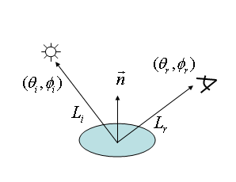
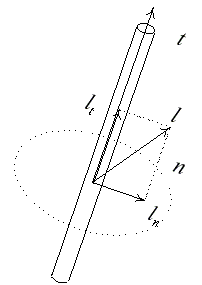

# Lighting models formulas

Основные обозначения

 - $n$ - единичный вектор нормали в точке.
 - $l$ - единичный вектор направления на источник света.
 - $v$ - единичный вектор направления на камеру (наблюдателя).
 - $h = \frac{l + v}{|l + v|}$ - биссектор векторов на источник света и камеру.
 - $\cos\theta_l=(n,l)$ - косинус угла между нормалью к поверхности в точке и направлением на источник света.
 - $\cos\theta_v=(n,v)$ - косинус угла между нормалью к поверхности в точке и направлением на камеру.

## Lambert

Простейшая модель освещения - чисто диффузное освещение. Считается, что свет падающий в точку, одинакового рассеивается по всем направлением полупространства. Таким образом, освещенность в точке определяется только плотностью света в точке поверхности, а она линейно зависит от косинуса угла падения.

$$I=\max(0,(n,l))$$

Для отсечения случая, когда косинус угла отрицателен, в уравнение включено отсечение значений косинуса, меньших нуля.

## Wrap-around
Также встречается небольшая модификация модели Ламберта, увеличивающая освещаемую область, за счет смещения $f$.

$$I=\frac{\max(0,(n,l) + f)}{1+f}$$

## Phong

Одной из самых распространенных моделей освещения, поддерживающих блики (specular hilights) является модель Фонга.

$$I=\max(0,(l,r))^p$$

Через $r$ в этой модели обозначен вектор, получающийся при отражении вектора наблюдателя относительно нормали. Если все вектора единичные, то справедлива формула:

$$r=2n(n,v)-v$$

## Blinn

$$I=\max(0,(n,h))^p$$

$$h=\frac{l + v}{|l + v|}$$

## Isotropic Ward

$$I=\exp^{-k \frac{1-(h,n)^2}{(h,n)^2}}$$

параметр k отвечает за неровность поверхности.

## Anisotropic Ward

$$I=\exp^{-\left(k \frac{(h,t)}{(h,n)}\right)^2}$$

## Oren-Nayar

Модель освещения Ламберта хорошо работает только для сравнительно гладких поверхностей. В отличии от нее модель Орен-Найара основана на предположении, что поверхность состоит из множества микрограней, освещение каждой из которых описывается моделью Ламберта. Модель учитывает взаимное закрывание и затенение микрограней и также учитывает взаимное отражение света между микрогранями. По этой модели, освещение задается следующей формулой:

$$I=\cos(\theta_L)(A+B\max(0,\cos(\phi_V-\phi_L))\sin(\alpha)\tan(\beta))$$

где:

$$A=1-0.5\frac{\sigma^2}{\sigma^2+0.33}$$

$$B=0.45\frac{\sigma^2}{\sigma^2+0.09}$$

$$\alpha=\min(\theta_L,\theta_V)$$

$$\beta=\max(\theta_L,\theta_V)$$

$\sigma$ - шероховатость поверхности

## Cook-Torrance

Одной из наиболее продвинутых и согласованных с физикой является модель освещение Кука-Торранса. Она также основана на модели поверхности состоящей из микрограней, каждая из которых является идеальным зеркалом. Модель учитывает коэффициент Френеля (формула здесь не приводится) и взаимозатенение микрограней.

$$I=\frac{FGD}{\pi(n,l)(n,v)}$$

В данной модели (как и в модели Орен-Найара) считается что угол $\theta$ между нормалью к микрограни и нормалью ко всей поверхности является случайно величиной, подчиняющейся закону распределения Бэкмана:

$$D_{Beckman}=\frac{1}{m^2\cos^4\theta}\exp(-\frac{\tan^2\theta}{m^2})$$

примечание: $\exp(-\frac{\tan^2\theta}{m^2})=e^{(-\frac{\tan^2\theta}{m^2})}=e^{-(\frac{\tan\theta}{m})^2}$

За затенение отдельных микрограней отвечает функция $G(n,l,v,h)$:

$$G=\min\left(1,\frac{2(n,h)(n,v)}{(v,h)},\frac{2(n,h)(n,l)}{(v,h)}\right)$$

## Anisotropic model

Все ранее рассмотренные модели являются изотропными, т.е. при повороте поверхности вокруг вектора нормали, освещение в точке не изменяется. Однако есть целый ряд материалов (например поверхность компакт-диска) для который это условие не выполняется.

Используемые для освещения подобных поверхностей модели называются анизотропными. При этом, для того чтобы можно было учитывать поворот грани вокруг вектора нормали, на поверхности нужно ввести поле касательных векторов, т.е. каждой точке поверхности сопоставляется касательный вектор, перпендикулярный нормали. По касательному вектору и нормали можно найти еще один вектор, перпендикулярный нормали, так называемую бинормаль.

Взятые вместе, нормаль, касательная и бинормаль образуют так называемый касательный базис.

Простейшая анизотропная модель освещения основана на довольно простой модели — вся поверхность считается состоящей из бесконечно тонких нитей. Тогда в качестве касательного вектора в точке выступает касательная к нити, проходящей через данную точку.

$$I_\text{diff}=\sqrt{1-(t,l)^2}$$

$$I_\text{spec}=\big(1-(t,l)^2\big)^{\frac{p}{2}}$$

## Minnaert

Эта модель была предложена для моделирования освещения планет, также довольно хорошо она подходит для моделирования некоторых видов ткани, например вельвета.

$$I=(n,l)^{1 + k}(1-(n,v))^{1-k}$$

*В модели присутствует визуальный артефакт. Выглядит как темное тонкое пятно на поверхности направленых в камеру. Вероятнее в модели предполагалось оттенить края планет. Прилагаю вариант исправляющий этот момент путем удаления инверсии вычисления (n,v):*

$$I=(n,l)^{1 + k}(n,v)^{1-k}$$

## Ashikhmin-Shirley

$$I_\text{diff}=\frac{28R_d}{23\pi}(1-R_s)\left(1-\left(1-\frac{(n,l)}{2}\right)^5\right)\left(1-\left(1-\frac{(n,v)}{2}\right)^5\right)$$

$$I_\text{spec}=\frac{\sqrt{(n_x + 1)(n_y + 1)}}{8 \pi (h,l) max((n,l),(n,v))}(n,h)^{n_u \cos^2{\phi} + n_v sin^2\phi}F((h,l))$$

## Gooch

Еще одной искусственной моделью освещения является модель Ами Гуч. В этой модели диффузная освещенность из модели Ламберта используется для смешивания двух оттенков - "теплого" и "холодного".

$$I=lerp\left(C_{cool},C_{warm},\frac{(n,l) + 1}{2}\right)$$

## Rim

Можно слегка изменить стандартную модель освещения, добавив в нее подсветку краев, т.е. мест, где вектор нормали перпендикулярен вектору на наблюдателя.

$$I=(1 + b - \max(0,(n,v)))^p$$

## Subsurface scattering

нет формул

## Bidirectional Lighting

Кроме модели Гуч есть еще несколько простых моделей освещения, использующие интерполяцию между двумя или тремя цветами. Одной из таких моделей является модель bidirectional lighting. Ее можно рассматривать как освещение сразу с двух противоположных сторон сторон источниками с разными цветами:

$$I=C_0\max({0,(n,l)}) + C_2\max({0,(-n,l)})$$

## Hemispheric Lighting

Эта модель подобно модели Гуч использует диффузную освещенность для линейной интерполяции цветов.

$$I=lerp(C_2,C_0,\frac{(n,l) + 1}{2})$$

## Trilight Model

Данная модель является обобщением двух предыдущих.

$$I=C_0\max({0,(n,l)}) + C_1 (1-|(n,l)|) + C_2\max({0,(-n,l)})$$

## Lommel-Seeliger model

$$I=C_0\frac{\max(0,(n,l))}{\max(0,(n,l))+\max(0,(n,v))}$$

## Strauss model

нет формул

---------------------
End